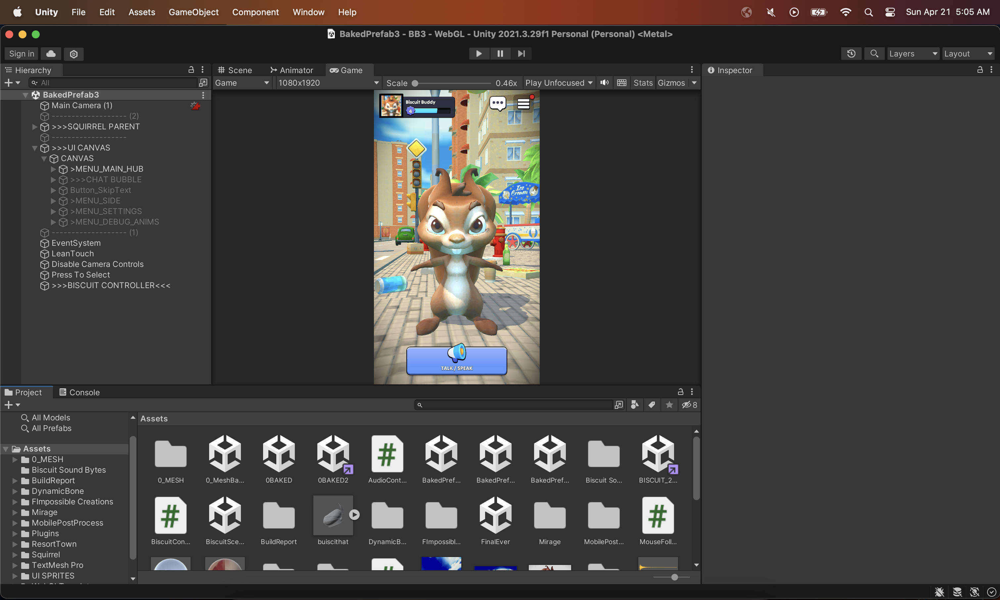
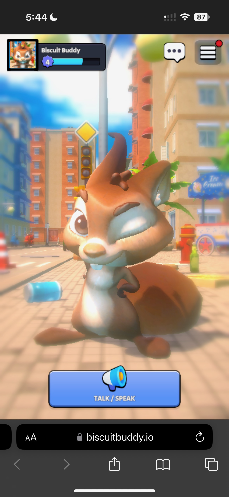
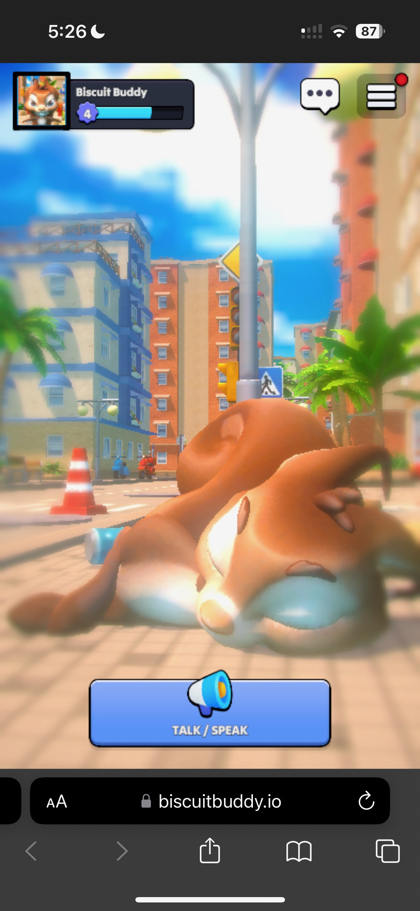
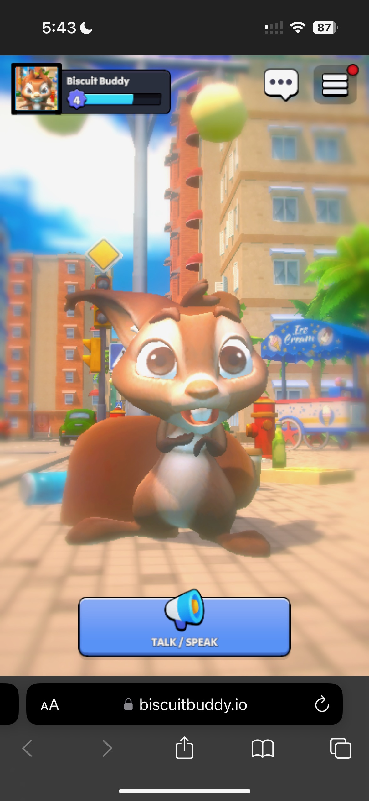

# Biscuit Buddy 🐿️🐿️🐿️
- *PLAY NOW ON MOBILE OR LAPTOP WEB BROWSER: https://biscuitbuddy.io*
- *UNITY PROJECT: https://drive.google.com/drive/folders/1LHQqRQyaWrjNj6yIE_D5zK4E76JGCFsC?usp=drive_link*
  

## What is BiscuitBuddy?

Meet Biscuit, your local neighborhood squirrel!

Chat, bond, level up, and compete to become Biscuits #1 best friend! 

- Speak to Biscuit by holding down on the "Talk" button, and release the button when you are done talking.
- Biscuit will process your audio and respond with a customized and personal answer.
- Biscuit will physically react to your tonality, and give you friendship points based on the depth of your conversation with her.
- Biscuit Buddy is designed for maximum accessibility, playable directly in both desktop and mobile web browsers, via https://biscuitbuddy.io*. By embracing a web-based platform, we've eliminated the barriers posed by native app distribution, ensuring a broad reach beyond any single operating system or app store. Moreover, with an initial download size of just 8 MB, Biscuit Buddy offers virtually instant load times, providing a seamless experience for players with decent internet connectivity.

## How Was It Made?

### Client-Side
- **Unity**: Developed using Unity 2023.2.19, targeting WebGL.

### Backend 
- **Digital Ocean**: Using an $8 digital ocean droplet running on Ubuntu as server.
- **NGINX & FastAPI**: Utilizing NGINX as the web server and FastAPI for RESTful API management.

### AI and Interaction Design
- **Getting Voice**: Uses Javascript to request users microphone
- **Processing Voice**: We use OpenAI Whisper to convert the recorded audio into text. That text is then sent as a query to the 'Biscuit Brain' to generate Biscuit's response.
- **Biscuit's Brain**: Biscuits brain runs on the latest Google's Gemini 1.5 Pro model. The Gemini model along with 3 unique function tools determine:
  1) How many friendship points to give the player based off what they said (the more deep and meaningful the conversation with biscuit, the more friendship points the player gets)
  2) What animations Biscuit should play in reaction to what player said (if player said something mean, biscuit should get mad)
  3) When biscuit should sleep! (Must say "Sleep at once biscuit.")

  
  
  

*Biscuit Happy, Sleepy, and Scared, respectively*

## Known Bugs
- Mobile audio doesn't work when you click! It uploads to backend properly, but doesn't process through OpenAI whisper properly.
- Minor UI distortions 
- Mic appears to always be on once enabling, despite us not recording anything

## Future Work
- Fix bugs !!
- Further research into different Gemini function tools and determine features to advance the project
- Implement settings, leaderboards, and player accounts
- Summarize key points at the end of conversations, and add that to all future prompts that user has with biscuit.
- Add more characters to the game that players can swap in and out in place of biscuit
- Setup messaging functionality with Biscuit, for those that don't like using their microphone
- View past conversations with biscuit

- *The Unity Project is 1.5GB in size which would have taken 1+ hour to upload to github (because so many large files), so I uploaded just main CS scripts in here for the before 8AM submission. I just uploaded the Assets folder to google drive, and added the link to the top of the readme, which is why there is this commit at 8:41PM
