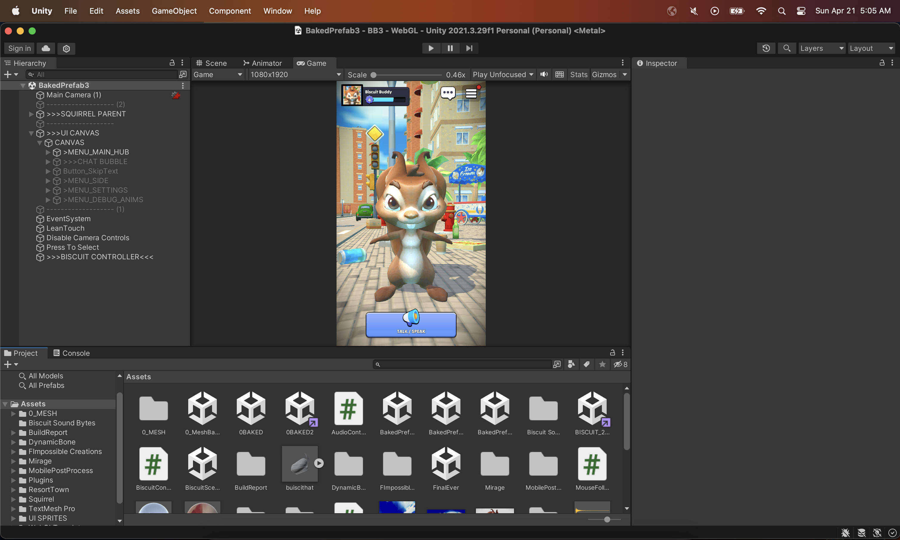
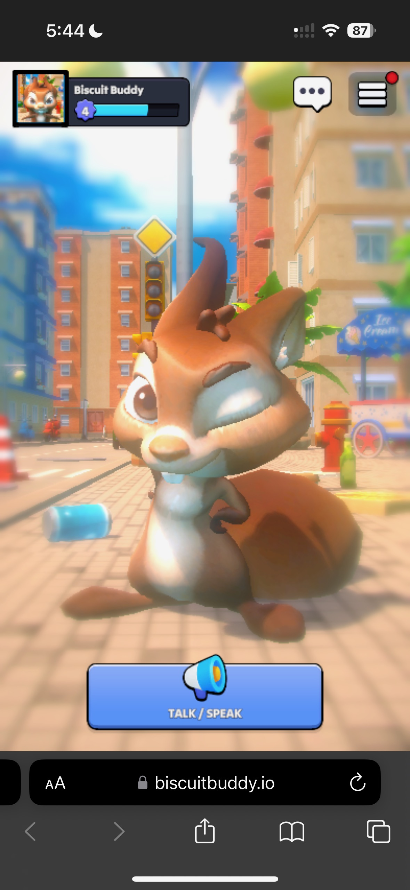
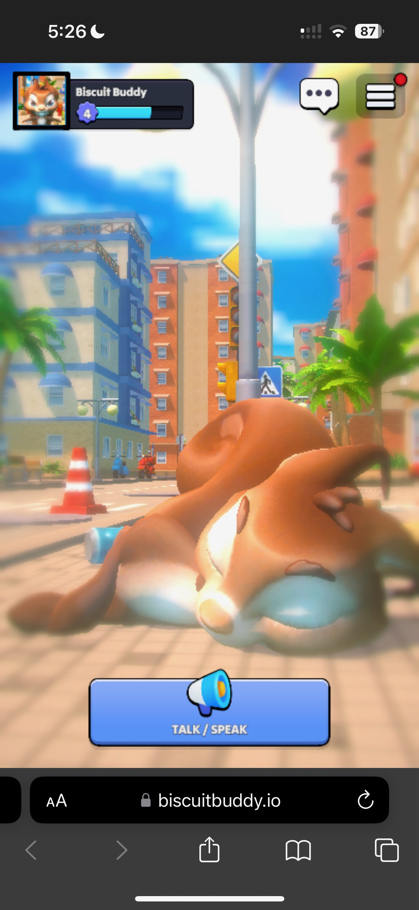
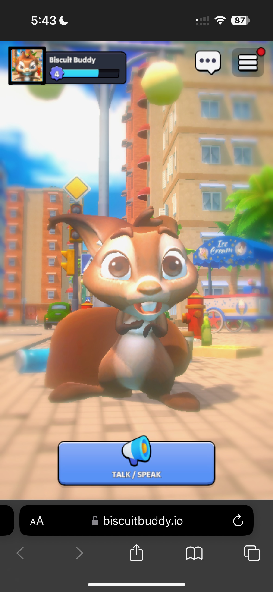

# Biscuit Buddy 🐿️🐿️🐿️
- *PLAY NOW ON MOBILE OR LAPTOP WEB BROWSER: https://biscuitbuddy.io*

## What is BiscuitBuddy?

Biscuit is your new best friend! Engage in meaningful conversations with her to enhance your bond and elevate your friendship levels!

Speak to Biscuit by holding down on the "Talk" button, and release the button when you are done talking. Biscuit will respond with a customized and personal response, physically reacting to your tonality, and giving you friendship points based on the depth of your conversation.

Biscuit Buddy is playable in Web Browser, on both traditional web browsers and mobile web browsers. This was done to make it as accessible as possible for players. Building for just Android or iOS would limit the games reach. Biscuit Buddy's inital download size is a mere 8 MBs, ensuring instant load times for anyone with decent wifi.

## How Was It Made?

### Client-Side
- **Unity**: Developed using Unity 2023.2.19, targeting WebGL.

### Backend 
- **Digital Ocean**: Using an $8 digital ocean droplet running on Ubuntu as server.
- **NGINX & FastAPI**: Utilizing NGINX as the web server and FastAPI for RESTful API management.

### AI and Interaction Design
- **Getting Voice**: Uses Javascript to request users microphone
- **Processing Voice**: We use OpenAI Whisper to convert the recorded audio into text. That text is then sent as a query to the 'Biscuit Brain' to generate Biscuit's response.
- **Biscuit's Brain**: Biscuits brain runs on the latest Google's Gemini 1.5 Pro model. The Gemini model along with 3 unique function tools determine:
  1) How many friendship points to give the player based off what they said (the more deep and meaningful the conversation with biscuit, the more friendship points the player gets)
  2) What animations Biscuit should play in reaction to what player said (if player said something mean, biscuit should get mad)
  3) When biscuit should sleep! (Must say "Sleep at once biscuit.")

  
  
  

*Biscuit Happy, Sleepy, and Scared, respectively*

## Future Work
- Fix bugs !!
- Start playing around with Gemini function tools more, see what cool things can get built.
- Implement settings
- Implement leaderboards
- Add player accounts
- Summarize key points at the end of conversations, and add that to all future prompts that user has with biscuit.
- Add more  characters to the game that players can swap in and out in place of biscuit
- Setup messaging functionality with Biscuit, for those that don't like using their microphone
- View past conversations with biscuit
